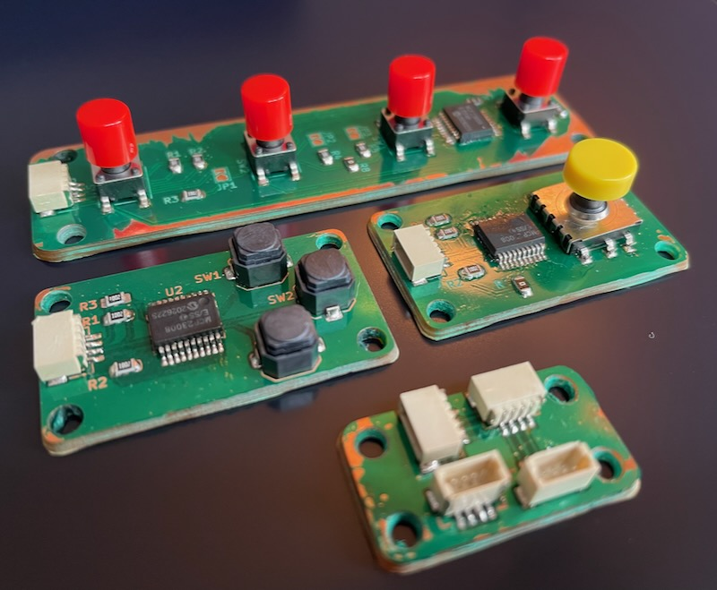

fingertips
---

4 button I2C keypad used in combination with:

* [5wayjoy](https://github.com/mikeysklar/5wayjoy) - 5 way tactile joystick I2C STEMMA
* [QtHub](https://github.com/mikeysklar/qthub) - 4 way multidirectional hub I2C STEMMA
* [old-softie](https://github.com/mikeysklar/old-softie) -  3 soft silicon buttons I2C STEMMA

An addition I2C hub and controller is used to run the CircuitPython code needed to translate chords into ascii chars.

